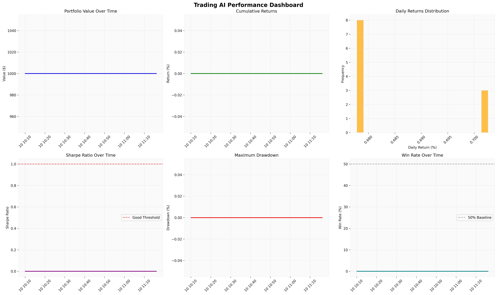

<div align="center">
  <br />
  <h1>📈 Système de Trading IA Hybride 📈</h1>
  <p>
    Un système expert d'aide à la décision pour le trading d'ETFs sur le NASDAQ, exploitant une intelligence artificielle hybride tri-modale pour des signaux de trading robustes et nuancés.
  </p>
</div>

<div align="center">

[](https://github.com/laurentvv/Trading-AI)
[](https://www.python.org/downloads/)
[](https://opensource.org/licenses/MIT)

</div>

<p align="center">
  
</p>

---

## 📚 Table des Matières

- [🌟 À Propos du Projet](#-à-propos-du-projet)
  - [✨ Fonctionnalités Clés](#-fonctionnalités-clés)
  - [💻 Stack Technologique](#-stack-technologique)
- [📂 Structure du Projet](#-structure-du-projet)
- [🚀 Démarrage Rapide](#-démarrage-rapide)
  - [✅ Prérequis](#-prérequis)
  - [⚙️ Installation](#️-installation)
- [🛠️ Utilisation](#️-utilisation)
  - [Analyse Manuelle](#-analyse-manuelle)
  - [Analyse Automatisée avec le Planificateur Intelligent](#-analyse-automatisée-avec-le-planificateur-intelligent)
- [🤝 Contribuer](#-contribuer)
- [📜 Licence](#-licence)
- [📧 Contact](#-contact)

---

## 🌟 À Propos du Projet

Ce projet est un système de support à la décision de trading qui utilise une approche d'IA hybride tri-modale pour générer des signaux de trading pour les ETFs du NASDAQ. Il est conçu pour fournir une analyse complète et nuancée en combinant plusieurs perspectives d'IA pour aboutir à une décision consensuelle et pondérée.

Le système combine :
1.  Un **modèle quantitatif classique** (`scikit-learn`) entraîné sur des indicateurs techniques et des données macroéconomiques.
2.  Un **Large Language Model (LLM)** pour une analyse contextuelle des données de marché brutes.
3.  Un **LLM multi-modal (V-LLM)** qui analyse des graphiques financiers pour une interprétation visuelle des tendances.

L'objectif est de fusionner ces trois signaux pour produire une décision de trading finale (`ACHAT`, `VENTE`, `NEUTRE`) accompagnée d'un score de confiance.

### ✨ Fonctionnalités Clés

- **Moteur IA Hybride Tri-Modal** : Combine trois modèles d'IA pour une décision par consensus.
- **Backtesting Robuste** : Utilise une validation *walk-forward* pour une évaluation réaliste des performances historiques.
- **Planificateur Intelligent** : Gère le cycle de vie du déploiement, des analyses quotidiennes aux rapports de performance.
- **Gestion de Risque Avancée** : Évalue le risque de marché et ajuste les décisions en conséquence.
- **Pondération Adaptative** : Ajuste dynamiquement l'influence de chaque modèle en fonction de leurs performances et de la confiance.
- **Explicabilité (XAI)** : Intègre des outils comme SHAP pour interpréter les prédictions du modèle quantitatif.
- **Monitoring de Performance** : Génère des tableaux de bord visuels pour suivre les performances du système.
- **Mise en Cache des Données** : Met en cache les données de marché pour accélérer les exécutions futures.

### 💻 Stack Technologique

- **Langage** : `Python 3.10+`
- **Calculs & Données** : `pandas`, `numpy`, `yfinance`, `pyarrow`, `pandas_datareader`
- **Machine Learning** : `scikit-learn`, `shap`
- **IA & LLM** : `requests`, `ollama`
- **Web Scraping** : `beautifulsoup4`
- **Visualisation** : `matplotlib`, `seaborn`, `mplfinance`
- **Utilitaires** : `tqdm`, `rich`, `python-dotenv`, `schedule`

---

## 📂 Structure du Projet

Le projet est organisé de manière modulaire pour une meilleure maintenabilité.

```
Trading-AI/
├── src/                     # Code source principal
│   ├── main.py              # Point d'entrée pour l'analyse manuelle
│   ├── intelligent_scheduler.py # Planificateur intelligent pour l'exécution automatique
│   ├── data.py              # Gestion des données (API, cache)
│   ├── features.py          # Création des indicateurs techniques
│   ├── classic_model.py     # Modèle quantitatif Scikit-learn
│   ├── llm_client.py        # Client pour les modèles de langage (Ollama)
│   ├── backtest.py          # Moteur de backtesting
│   └── ...                  # Autres modules (graphiques, XAI, etc.)
├── data_cache/              # Données de marché mises en cache
├── memory-bank/             # Documentation et contexte pour l'agent IA
├── .env                     # Fichier pour les clés d'API (à créer)
├── requirements.txt         # Dépendances Python
├── start_scheduler.bat      # Script de démarrage pour le planificateur (Windows)
└── README.md                # Cette documentation
```

---

## 🚀 Démarrage Rapide

Suivez ces étapes pour mettre en place votre environnement de développement local.

### ✅ Prérequis

- Python 3.10 ou supérieur
- [Ollama](https://ollama.com/) installé et en cours d'exécution localement.
- Un modèle LLM téléchargé (ex: `ollama pull gemma3:27b`)

### ⚙️ Installation

1.  **Clonez le dépôt :**
    ```sh
    git clone https://github.com/laurentvv/Trading-AI.git
    cd Trading-AI
    ```
2.  **Créez et activez un environnement virtuel :**
    ```sh
    python -m venv .venv
    source .venv/bin/activate  # Sur Windows: .venv\Scripts\activate
    ```
3.  **Installez les dépendances :**
    ```sh
    pip install -r requirements.txt
    ```
4.  **Configurez votre clé API :**
    Créez un fichier `.env` à la racine du projet et ajoutez votre clé API Alpha Vantage :
    ```
    ALPHA_VANTAGE_API_KEY="VOTRE_CLE_API_ICI"
    ```

---

## 🛠️ Utilisation

Le système peut être utilisé de deux manières principales.

### Analyse Manuelle

Pour lancer une analyse unique et obtenir une décision de trading immédiate.

```sh
python src/main.py
```

Le script va :
1.  Récupérer les données de marché.
2.  Lancer un backtest *walk-forward*.
3.  Générer un graphique pour l'analyse visuelle.
4.  Produire une décision de trading finale basée sur les trois modèles.
5.  Sauvegarder un graphique d'analyse du backtest (`backtest_analysis.png`).

### Analyse Automatisée avec le Planificateur Intelligent

Le projet inclut un planificateur intelligent qui gère le déploiement, les analyses quotidiennes, les rapports et les transitions de phase du projet.

Pour les utilisateurs Windows, le moyen le plus simple de démarrer le planificateur est d'utiliser le script batch fourni :
```bash
start_scheduler.bat
```

Alternativement, vous pouvez exécuter le script Python directement :
```bash
python src/intelligent_scheduler.py
```
Le planificateur s'exécutera en arrière-plan et consignera toutes ses activités dans `scheduler.log`.

---

## 🤝 Contribuer

Les contributions sont ce qui fait de la communauté open source un endroit extraordinaire pour apprendre, inspirer et créer. Toutes les contributions que vous faites sont **grandement appréciées**.

Si vous avez une suggestion pour améliorer ce projet, veuillez forker le dépôt et créer une pull request. Vous pouvez aussi simplement ouvrir une issue avec le tag "enhancement".

1.  Forkez le Projet
2.  Créez votre branche de fonctionnalité (`git checkout -b feature/AmazingFeature`)
3.  Commitez vos changements (`git commit -m 'Add some AmazingFeature'`)
4.  Poussez vers la branche (`git push origin feature/AmazingFeature`)
5.  Ouvrez une Pull Request

---

## 📜 Licence

Distribué sous la licence MIT. Voir `LICENSE` pour plus d'informations (fichier à ajouter si non présent).

---

## 📧 Contact

Lien du projet : [https://github.com/laurentvv/Trading-AI](https://github.com/laurentvv/Trading-AI)