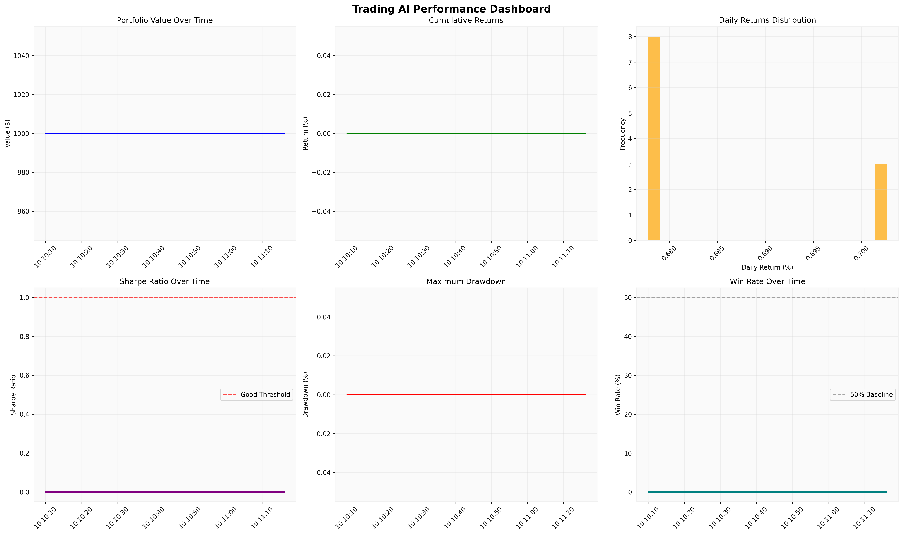

<div align="center">
  <br />
  <h1>📈 Système de Trading IA Hybride 📈</h1>
  <p>
    Un système expert d'aide à la décision pour le trading d'ETFs sur le NASDAQ, exploitant une intelligence artificielle hybride tri-modale pour des signaux de trading robustes et nuancés.
  </p>
</div>

<div align="center">

[](https://github.com/laurentvv/Trading-AI)
[](https://www.python.org/downloads/)
[](https://opensource.org/licenses/MIT)

</div>

<p align="center">
  
</p>

---

## 📚 Table des Matières

- [🌟 À Propos du Projet](#-à-propos-du-projet)
  - [✨ Fonctionnalités Clés](#-fonctionnalités-clés)
  - [💻 Stack Technologique](#-stack-technologique)
- [📂 Structure du Projet](#-structure-du-projet)
- [🚀 Démarrage Rapide](#-démarrage-rapide)
  - [✅ Prérequis](#-prérequis)
  - [⚙️ Installation](#️-installation)
- [🛠️ Utilisation](#️-utilisation)
  - [Analyse Manuelle](#-analyse-manuelle)
  - [Analyse Automatisée avec le Planificateur Intelligent](#-analyse-automatisée-avec-le-planificateur-intelligent)
- [🤝 Contribuer](#-contribuer)
- [📜 Licence](#-licence)
- [📧 Contact](#-contact)

---

## 🌟 À Propos du Projet

Ce projet est un système expert d'aide à la décision pour le trading d'ETFs, utilisant une approche d'IA hybride tri-modale. Il est conçu pour fournir une analyse complète et robuste en combinant plusieurs perspectives d'IA.

### 🚀 Stratégie Dual-Ticker (Analyse vs Trading)
Le système utilise une approche innovante pour maximiser la précision des modèles :
- **Analyse Haute Fidélité** : Les modèles IA analysent les **indices de référence mondiaux** (`^NDX` pour le Nasdaq, `CL=F` pour le pétrole WTI). Ces indices offrent un historique plus long et des tendances plus "pures", sans le bruit lié aux horaires de cotation ou aux frais des ETFs.
- **Exécution sur ETF** : Les ordres réels sont passés sur les tickers correspondants sur **Trading 212** (`SXRV.DE`, `CRUDP.PA`), en utilisant les **prix live T212** (via API positions) pour le dimensionnement des positions.

### 🧠 Moteur IA Hybride
Le système fusionne huit signaux distincts :
1.  **Modèle Quantitatif Classique** : Ensemble RandomForest/GradientBoosting/LogisticRegression entraîné sur indicateurs techniques et macroéconomiques.
2.  **TimesFM 2.5 (Google Research)** : Modèle de fondation de pointe pour la prévision de séries temporelles.
3.  **Modèle Oil-Bench (Gemma 4:e4b)** : Modèle spécialisé dans l'énergie fusionnant les données fondamentales de l'**EIA** (Stocks, Imports, Raffineries) et le sentiment pour le trading du WTI.
4.  **LLM Textuel (Gemma 4:e4b)** : Analyse contextuelle des données brutes, des actualités en temps réel via le skill **AlphaEar**, et intégration de **recherches web macro-économiques** dynamiques.
5.  **LLM Visuel (Gemma 4:e4b)** : Analyse directe des graphiques techniques (`enhanced_trading_chart.png`).
6.  **Sentiment Analysis** : Analyse hybride combinant Alpha Vantage et les tendances "hot" d'**AlphaEar** (Weibo, WallstreetCN).
7.  **Données Décentralisées (Hyperliquid)** : Analyse du sentiment spéculatif sur le Pétrole (WTI) via le *Funding Rate* et l'*Open Interest*.
8.  **Modèle Vincent Ganne** : Analyse géopolitique et cross-asset (WTI, Brent, Gaz, DXY, MA200) pour la détection de points bas macroéconomiques.

L'objectif est de produire une décision finale (`ACHAT`, `VENTE`, `HOLD`) avec une priorité absolue sur la **justesse** (Accuracy First).

### 🧘 Philosophie de Décision : "La Prudence Cognitive"
Contrairement aux algorithmes de trading classiques qui paniquent dès que la volatilité explose, ce système applique une approche d'investisseur averti :
- **Consensus Fort Requis** : Un modèle quantitatif (Classic) peut crier au loup (`SELL`), mais si les modèles cognitifs (LLM Texte, Vision, TimesFM) restent neutres, le système privilégiera le `HOLD`.
- **Filtre de Confiance** : Une décision de mouvement (Achat ou Vente) n'est validée que si la confiance globale dépasse un seuil de sécurité (généralement 40%). En dessous, le système considère le signal comme du "bruit" et reste en attente.
- **Protection du Capital** : En mode `VERY_HIGH` risque, le `HOLD` serv de bouclier. Il empêche d'entrer sur un marché instable et évite de sortir prématurément sur une simple correction technique si les fondamentaux (News/Vision/Hyperliquid) ne confirment pas un crash imminent.

### ✨ Fonctionnalités Clés

- **Approche Dual-Ticker** : Analyse l'indice, trade l'ETF.
- **Prix Live T212** : Récupération temps réel des prix EUR via l'API Trading 212 (0.2s), avec fallback yfinance et cache parquet.
- **Résilience Réseau** : Circuit breaker yfinance avec trackers séparés (info vs download), timeout 10s sur tous les appels réseau.
- **Cognition Avancée** : Utilisation de **Gemma 4** pour une meilleure synthèse technique/fondamentale.
- **News & Sentiment Blockchain** : Intégration d'**AlphaEar** et d'**Hyperliquid** pour capturer le sentiment social et spéculatif.
- **Scheduler Automatisé** : Script `schedule.py` pour une exécution continue (8h30-18h00) sur serveur.
- **Gestion de Risque Avancée** : Ajustement automatique du signal en fonction de la volatilité et du régime de marché.

### 💻 Stack Technologique

- **Langage** : `Python 3.12+`
- **Calculs & Données** : `pandas`, `numpy`, `yfinance`, `pyarrow`, `pandas_datareader`, `hyperliquid-python-sdk`
- **Machine Learning** : `scikit-learn`, `shap`
- **IA & LLM** : `requests`, `ollama`
- **Web Scraping & Search** : `beautifulsoup4`, `duckduckgo_search`
- **Visualisation** : `matplotlib`, `seaborn`, `mplfinance`
- **Utilitaires** : `tqdm`, `rich`, `python-dotenv`, `schedule`

---

## 📂 Structure du Projet

Le projet est organisé de manière modulaire pour une meilleure maintenabilité.

```
Trading-AI/
├── src/                     # Modules coeurs
│   ├── enhanced_decision_engine.py # Moteur de fusion et Modèle Vincent Ganne
│   ├── advanced_risk_manager.py    # Gestion des risques Trend-Aware
│   ├── adaptive_weight_manager.py  # Pondération dynamique des modèles
│   ├── t212_executor.py            # Exécution réelle sur Trading 212
│   ├── timesfm_model.py            # Intégration TimesFM 2.5
│   └── ...                         # Data, Features, LLM Client
├── tests/                   # Scripts de tests et validation
├── data_cache/              # Données de marché et macro (Parquet)
├── main.py                  # Point d'entrée unique (Analyse & Trading)
├── schedule.py              # Scheduler live (8h30-18h00)
├── backtest_engine.py       # Moteur de backtesting historique
├── .env                     # Clés API (Alpha Vantage, T212)
└── README.md                # Cette documentation
```

---

## 🚀 Démarrage Rapide

Suivez ces étapes pour mettre en place votre environnement de développement local.

### ✅ Prérequis

- Python 3.12+ (via `uv`)
- [Ollama](https://ollama.com/) installé et en cours d'exécution localement.
- Un modèle LLM téléchargé : `ollama pull gemma4:e4b`

### ⚙️ Installation

1.  **Clonez le dépôt :**
    ```sh
    git clone https://github.com/laurentvv/Trading-AI.git
    cd Trading-AI
    ```
2.  **Installez `uv` (si ce n'est pas déjà fait) :**
    Consultez [astral.sh/uv](https://astral.sh/uv) pour les instructions d'installation.

3.  **Installez et Patchez TimesFM 2.5 (Étape CRUCIALE) :**
    Lancez le script d'installation pour cloner le modèle dans `vendor/` et appliquer les patchs :
    ```bash
    python setup_timesfm.py
    ```

4.  **Initialisez et synchronisez l'environnement :**
    ```bash
    uv sync
    ```

5.  **Installez les navigateurs pour la recherche Web (Crawl4AI) :**
    ```bash
    uv run python -m playwright install chromium
    ```

6.  **Configurez votre clé API :**
    Créez un fichier `.env` à la racine du projet et ajoutez votre clé API Alpha Vantage :
    ```
    ALPHA_VANTAGE_API_KEY="VOTRE_CLE_API_ICI"
    ```

---

## 🛠️ Utilisation

Le système est conçu pour être simple et puissant. Il entraîne ses modèles sur les données les plus récentes à chaque exécution avant de donner une décision.

### Mode Simulation (Paper Trading)

Pour tester le système sans risque avec un capital fictif de 1000 €, utilisez le flag `--simul`. Le système gérera un historique strict d'achats et de ventes.

```sh
# Lancer une analyse simulée (Défaut: SXRV.DE - Nasdaq 100 EUR)
uv run main.py --simul

# Lancer une exécution réelle sur Trading 212 (Demo ou Real selon .env)
uv run main.py --t212
```

### Exécution Réelle (Trading 212)

Le système est désormais **pleinement intégré** avec Trading 212 :
- **Vérification du Portefeuille** : Avant toute action, le robot consulte votre cash réel et vos positions.
- **Calcul Précis des Fractions** : Calcule le nombre d'actions exact pour atteindre votre budget cible.
- **Tickers Certifiés** : Utilisation des identifiants exacts (`SXRVd_EQ` pour le Nasdaq EUR, `CRUDl_EQ` pour le Pétrole WTI).
- **Sécurité de Risque** : Le signal final est systématiquement filtré par le gestionnaire de risques avant l'envoi de l'ordre (Accuracy First).
- **Gestion des API** : Inclut des mécanismes de retry automatique contre les limites de requêtes (Rate Limiting).

Le script va :
1.  **Récupérer les données** de marché en temps réel.
2.  **Entraîner les modèles** d'IA (Ensemble RandomForest, GradientBoosting, etc.) sur l'historique complet.
3.  **Générer une décision hybride** combinant :
    - Modèle quantitatif classique.
    - Analyse de texte via **gemma4:e4b** (Ollama) enrichie par des recherches web macro-économiques.
    - Analyse visuelle des graphiques techniques.
    - Analyse de sentiment des actualités.
    - Prédiction de série temporelle via **TimesFM**.
4.  **Afficher un signal clair** avec le niveau de confiance et la taille de position recommandée.

### 📝 Journal de Bord
Le système génère un fichier **`trading_journal.csv`** ultra-détaillé à chaque exécution.
- **Transparence totale** : Enregistre le signal et la confiance de **chaque modèle individuel** (Classic, LLM, TimesFM, Vincent Ganne).
- **Audit de Risque** : Permet de vérifier si le Risk Manager a modifié le signal initial de l'IA.

### Sortie attendue

L'analyse produit un tableau récapitulatif directement dans votre terminal :
- **FINAL DECISION**: BUY / SELL / HOLD
- **CONFIDENCE**: Pourcentage de certitude
- **RISK LEVEL**: Évaluation du risque actuel du marché
- **REC. POSITION**: Montant suggéré pour l'investissement

Les graphiques d'analyse sont sauvegardés sous `enhanced_trading_chart.png`.


---

## 🤝 Contribuer

Les contributions sont ce qui fait de la communauté open source un endroit extraordinaire pour apprendre, inspirer et créer. Toutes les contributions que vous faites sont **grandement appréciées**.

Si vous avez une suggestion pour améliorer ce projet, veuillez forker le dépôt et créer une pull request. Vous pouvez aussi simplement ouvrir une issue avec le tag "enhancement".

1.  Forkez le Projet
2.  Créez votre branche de fonctionnalité (`git checkout -b feature/AmazingFeature`)
3.  Commitez vos changements (`git commit -m 'Add some AmazingFeature'`)
4.  Poussez vers la branche (`git push origin feature/AmazingFeature`)
5.  Ouvrez une Pull Request

---

## 📜 Licence

Distribué sous la licence MIT. Voir `LICENSE` pour plus d'informations (fichier à ajouter si non présent).

---

## 📧 Contact

Lien du projet : [https://github.com/laurentvv/Trading-AI](https://github.com/laurentvv/Trading-AI)
