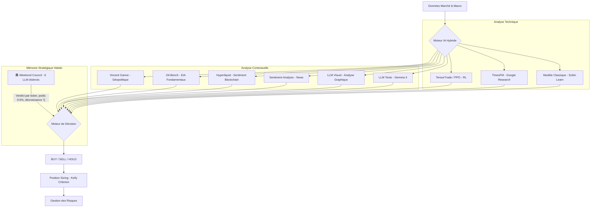

# 📉 Système de Trading IA Hybride - Résumé

Ce document résume l'architecture, les capacités et les performances du système de trading IA développé.

## 🚀 Architecture Globale

Le système repose sur une approche **multi-modale hybride**. Au lieu de faire confiance à un seul algorithme, il combine onze types d'intelligence pour prendre une décision finale, enrichie d'un **conseil stratégique hebdomadaire** (Weekend Council).



---

## 🧠 Modèles IA Utilisés

1.  **Modèle Classique (Ensemble) :**
    *   **Algorithmes :** RandomForest, GradientBoosting, et Régression Logistique.
    *   **Sélection :** Le système teste les 3 modèles via `TimeSeriesSplit` et sélectionne automatiquement le plus performant pour la journée.
    *   **Features :** 45 indicateurs (RSI, MACD, Bollinger, Moyennes Mobiles, Yields Trésorerie US, PIB, Chômage).

2.  **LLM (Gemma 4 : e4b) :**
    *   **Texte :** Analyse les données brutes et les indicateurs. Intègre les titres de presse en temps réel via le skill **AlphaEar** et les métriques décentralisées d'**Hyperliquid** pour une synthèse technique et fondamentale.
    *   **Visuel :** Analyse directement l'image du graphique technique (`enhanced_trading_chart.png`) pour identifier des patterns chartistes complexes.

3.  **TimesFM (Google Research) :**
    *   Modèle de fondation **TimesFM 2.5** spécialisé dans la prévision de séries temporelles.

4.  **TensorTrade / PPO (Reinforcement Learning) :**
    *   Agent **PPO** (stable-baselines3) entraîné à chaque cycle dans un environnement **Gymnasium** custom (`SimpleTradingEnv`).
    *   Apprend une politique d'achat/vente/conservation basée sur les variations de prix récentes.
    *   **Poids Progressif (0.05) :** En phase de test actif. Son influence s'ajuste via le feedback loop adaptatif.

5.  **Modèle Oil-Bench (Gemma 4 : e4b) :**
    *   **Expert Fondamental :** Modèle spécialisé activé uniquement pour le pétrole (`CL=F`, `CRUDP.PA`).
    * **Données EIA :** Analyse automatisée des stocks US, des importations mensuelles et du taux d'utilisation des raffineries.
    * **Poids Forcé (25%) :** Pour le pétrole, son avis macroéconomique est prioritaire et ne peut pas être réduit à zéro par l'Adaptive Weight Manager.
    * **Synthèse :** Produit une allocation cible (0-100%) basée sur la dynamique offre/demande physique.

6.  **Hyperliquid (Sentiment Blockchain) :**
    *   Récupération en temps réel du *Funding Rate* et de l'*Open Interest* sur les contrats perpétuels Pétrole (WTI). Utilisé comme signal contrarien pour détecter les excès spéculatifs.

7.  **Sentiment Analysis (Hybride) :**
    *   Combine les news d'Alpha Vantage avec les tendances "hot" d'**AlphaEar** (Weibo, WallstreetCN, etc.) pour une détection précoce des changements de sentiment.

8.  **Modèle Vincent Ganne (Géopolitique & Cross-Asset) :**
    *   **Validateur d'Achat Nasdaq :** Ce modèle est utilisé exclusivement pour valider des points bas sur le Nasdaq (`SXRV.DE`, `QQQ`). Il est désactivé pour le trading d'autres actifs.
    *   **Signal Unidirectionnel :** Il ne génère que des signaux `BUY` ou `HOLD`. Son but est de confirmer la détente macroéconomique (Pétrole < 94$, Dollar faible, MA200 franchie) pour autoriser une entrée sur les actions.
    *   **Filtre de Sécurité :** En cas de prix de l'énergie trop élevés (WTI > 94$), le modèle maintient un signal `HOLD` pour le Nasdaq, agissant comme un verrou de sécurité contre l'instabilité géopolitique.

9.  **🏛️ Weekend Council (Mémoire Stratégique Hebdomadaire) :**
    *   **Rétrospective Multi-Personas :** Tous les samedis à 01:00, six personas IA (Stratège / Gestionnaire de Risque / Quant / Sceptique / Tacticien / Comportementaliste) délibèrent sur la semaine écoulée. Chaque membre tourne sur une **5 familles de modèles distinctes (local Ollama + Cloud Gemini)** (Gemma 4 12B / GLM-4.6V-Flash / Qwen 3.5 9B / Gemini 2.5 Flash / Mistral Nemo 12B) pour garantir une **diversité de raisonnement réelle** — pas des changements de costume sur un seul modèle.
    *   **Protocole à 4 Rounds :** (0) Reformulation du problème → (1) Analyse indépendante avec stance explicite → débat 1-vs-1 dirigé → (3) Verdict du Juge. Un mécanisme anti-groupthink (dissent quota ≥2/3) force un steelman de la position opposée si un consensus trop rapide se forme.
    *   **11ème Voix du Consensus :** Le Juge (Gemini Pro) émet un verdict structuré par ticker (`SXRV.DE: SELL (0.90)`) qui devient une **voix à part entière dans le consensus temps réel** — poids 9.5%, décroissant linéairement sur 7 jours. Un verdict de samedi pèse 100% lundi, ~57% jeudi, 0% samedi suivant.
    *   **Contexte PROD Réel :** Le council n'analyse pas un flux générique — il ingère l'**accuracy réelle des modèles** (`model_performance.db`), les **alertes critiques** et métriques de portefeuille (`performance_monitor.db`), et le **journal de trading** (détection de biais directionnel).
    *   **Inspiration** : Adapté de [`0xNyk/council-of-high-intelligence`](https://github.com/0xNyk/council-of-high-intelligence). Voir `docs/ADR-003-weekend-council-11th-voice.md`.

---

## 🛡️ Gestion des Risques & Sizing (Advanced Risk Manager)

Le système intègre un **Advanced Risk Manager** intelligent conscient des spécificités des actifs et des erreurs de prédiction :

1.  **Oil Special Risk Mode (Fix) :** Le Pétrole profite souvent de la volatilité et des crises. Le système **booste désormais de 20%** les signaux d'achat en cas de risque `VERY_HIGH` pour le Pétrole, au lieu de les pénaliser. Les blocages forcés (HOLD) en cas de crise sont désactivés pour cette classe d'actif.
2.  **Sécurité Anti-Perte (Hard Block) :** L'exécuteur Trading 212 vérifie désormais le P&L réel de la position. Un ordre de vente (`SELL`) est **systématiquement bloqué** si la valeur actuelle est inférieure au prix d'achat initial (tolérance 0.2%). Le bot passe en mode "HOLD" jusqu'au retour à l'équilibre.
3.  **Trailing Stop (Stop Suiveur) :** Pour sécuriser les gains, le système suit la valeur maximale atteinte par la position (`highest_value`). Si le cours baisse de **3%** depuis son sommet **ET** que la position est en profit (> +0.5%), une vente est forcée pour sécuriser le cash.
4.  **Inertie de Sortie (Sticky HOLD) :** Lorsqu'une position est active, le système devient plus exigeant pour vendre (`SELL`). Il compare le prix actuel à l'**indice de référence lors de l'achat** (ex: prix du WTI à l'entrée). Si la position est gagnante sur l'indice, il faut un signal de vente très fort (> 0.55) pour sortir, protégeant ainsi la tendance haussière contre le bruit passager.
5.  **Poids Adaptatifs & Feedback Loop** : Chaque décision de chaque modèle est enregistrée dans `model_performance.db`. À chaque clôture de trade (SELL confirmé sur T212), le système met à jour les résultats réels (return_1d, win/loss) pour les modèles ayant prédit à la date d'entrée via `update_outcomes_for_date()`. Le système ajuste dynamiquement le poids de chaque IA en fonction de son "Win Rate" réel observé sur les jours précédents. Les poids de base sont normalisés à la volée (somme → 1.0) au moment du calcul pour garantir un score pondéré cohérent.
6.  **Trend-Awareness :** Le système détecte la tendance de fond (Prix vs MM50). En marché haussier (Bull Market), il devient plus réactif en abaissant le seuil de confiance requis pour l'achat.
7.  **Sizing Progressif :** L'exposition varie dynamiquement entre **75% et 100%** sur signal d'achat, selon la force du consensus de l'IA.

---

## 🕒 Automatisation (Scheduler)

Un nouveau script autonome `schedule.py` permet une exécution continue sur serveur :
- **Horaires :** Lundi au Vendredi, 8h30 à 18h00.
- **Fréquence :** Analyse et trading toutes les 30 minutes.
- **Morning Brief :** Génération automatique à 01:00 en semaine (rapport injecté dans le LLM).
- **🏛️ Weekend Council :** Déclenchement automatique le **samedi à 01:00** (subprocess isolé, fenêtre d'exécution 48h pour laisser les modèles thinking réfléchir sur CPU). Le verdict généré alimente le consensus toute la semaine suivante. Garde anti-double-exécution persistante (skip si le rapport du jour existe déjà).
- **Dashboard :** Suivi en temps réel de l'état du scheduler, du morning brief et du council.

---

## 📊 Tests de Validation (Backtests)

Deux tests majeurs ont été réalisés pour valider la robustesse :

### 1. Test Court (3 mois - Mai à Août 2025)
*   **Objectif :** Valider la stabilité technique du code.
*   **Résultat :** **+11.37% de rendement** en 3 mois.

### 2. Test Long (10 ans - 2015 à 2025)
*   **Conditions :** Capital initial de 1000 €, décision tous les 7 jours, frais de transaction inclus (0.1%).
*   **Rendement IA :** **+221.95%** (Capital final : **3219.45 €**).
*   **Comparaison :** L'IA a plus que triplé le capital initial. Elle a cependant sous-performé l'indice QQQ brut (+525%) car elle a privilégié la protection du capital lors des crises (notamment 2020 et 2022).

---

## 🎯 Prise de Décision : L'Algorithme de "Justesse"

Le système ne se contente pas d'additionner les signaux. Il applique une logique de filtrage rigoureuse pour éviter les faux signaux :

1.  **Pondération Cognitive avec Normalisation** : Les poids de base sont distribués entre les modèles actifs (classic 13%, llm_text 21%, llm_visual 19%, sentiment 16%, timesfm 21%) et les modèles en phase de test (vincent_ganne, oil_bench, tensortrade — chacun 5%). Ces poids sont **normalisés dynamiquement à la volée** (division par la somme totale) avant le calcul du score pondéré, garantissant un score toujours sur l'échelle attendue. Les modèles cognitifs dominent la décision (~73% après normalisation).
2.  **Seuil de Confiance Critique (40%)** : Toute décision de mouvement (`BUY` ou `SELL`) doit avoir une confiance globale > 40%. Si la confiance est entre 20% et 40%, le signal est dégradé en `HOLD`.
3.  **Gestion de la Panique** : En risque `VERY_HIGH`, le système exige un consensus quasi-parfait. Si les modèles divergent (ex: Classic dit SELL mais LLM dit HOLD), le système reste en `HOLD` pour protéger le capital.

| Élément | Description |
| :--- | :--- |
| **FINAL DECISION** | `BUY`, `SELL` ou `HOLD`. |
| **CONFIDENCE** | Score de 0 à 100% basé sur le consensus des modèles. |
| **RISK LEVEL** | Évaluation du risque (VERY LOW à VERY HIGH) basée sur la volatilité. |
| **REC. POSITION** | Montant exact à investir basé sur le critère de Kelly. |

---

## 🎮 Mode Simulation (Paper Trading)

Le système inclut un mode simulation persistant pour tester les performances en temps réel sans risque.

### Caractéristiques :
- **Capital Initial :** 1000 € (fixe).
- **Persistance :** L'état du portefeuille et l'historique des trades sont sauvegardés dans une base de données SQLite locale (non trackée dans git).
- **Logique Strict :** Le mode simulation impose une alternance Achat -> Vente. Il est impossible d'acheter si le capital est déjà engagé, ou de vendre si aucune action n'est détenue.

```bash
# Lancer la simulation quotidienne (Défaut: SXRV.FRK)
uv run main.py --simul
```

---

## 🤖 Exécution Réelle (Trading 212)

Le système peut désormais passer des ordres réels sur un compte Trading 212 via l'API.

### Caractéristiques :
- **Sécurité et Vérification** : Consulte le cash réel et les positions ouvertes **avant** toute action.
- **Prix Temps Réel T212** : Récupère le prix live en EUR via l'API positions Trading 212 (`get_t212_price()`). Plus rapide et plus fiable que yfinance pour les ETFs cotés.
- **Injection Prix Live dans l'Analyse** : `_inject_t212_live_price()` (dans `src/data.py`) patche automatiquement la dernière barre OHLCV des ETFs tradeables (SXRV.DE, SXRV.FRK, CRUDP.PA) avec le prix live T212 après le chargement des données Yahoo. Les indices (^NDX, ^VIX, CL=F) restent intouchés.
- **Portfolio Sync T212** : `sync_state_from_t212()` reconstruit l'état du portefeuille depuis les données T212 réelles (positions ouvertes + P&L réalisé via FIFO). T212 est la source de vérité primaire ; le fichier JSON local sert de fallback offline.
- **Tickers Certifiés** : Utilisation des identifiants d'instruments exacts pour garantir l'exécution (`SXRVd_EQ` pour le Nasdaq EUR, `CRUDl_EQ` pour le Pétrole WTI).
- **Logique de Signal Ajusté** : Le robot utilise le signal filtré par le `AdvancedRiskManager`. Si le risque est jugé trop élevé par rapport à la confiance, l'exécution est bloquée (conversion en `HOLD`).
- **Budget Dédié :** Budget initial configurable par ticker (`INITIAL_BUDGETS` dans `t212_executor.py`) : 1000 € par défaut (SXRVd_EQ, SXRV_EQ, CRUDl_EQ).
- **Actions Fractionnées :** Le système calcule la quantité exacte pour respecter le budget au centime près.
- **Vente Totale :** En cas de signal SELL, le robot liquide 100% de la position (incluant toutes les fractions).
- **Gestion des API** : Retry automatique en cas de limite de requêtes API (Rate Limit).
- **Feedback Loop d'Apprentissage** : Après chaque vente confirmée sur T212, le système enregistre le résultat réel (profit/perte) dans `model_performance.db` via `update_outcomes_for_date()`, permettant à l'Adaptive Weight Manager d'ajuster les poids des modèles en fonction de leur performance réelle.
- **Synchronisation Réelle du Portefeuille** : `load_portfolio_state()` utilise T212 comme source primaire via `sync_state_from_t212()`, qui interroge `/equity/positions` et `/equity/history/orders` pour reconstruire l'état réel (positions, P&L, lots FIFO). Le fichier JSON local est mis à jour après chaque sync et sert de fallback offline.

### Résilience Réseau :
- **Circuit Breaker yfinance** : Deux trackers séparés (`info` vs `download`). Après 3 échecs consécutifs, les appels sont bloqués 120s. Empêche les cascades de timeouts.
- **Hiérarchie de prix** : T212 live → yfinance → cache parquet.
- **Données Hybrides** : Yahoo pour l'OHLCV historique (pas de candles API sur T212 v0) + T212 pour le prix live injecté dans la dernière barre. Approche optimale combinant profondeur historique et fraîcheur du prix courant.
- **Timeout 10s** sur tous les appels réseau (yfinance, Alpha Vantage).
- **Skip metadata** : `_yf_ticker_info()` ignoré quand le cache parquet existe (gain ~30-50s/cycle).
- **Cache Auto-Invalidation** : Si la dernière donnée du cache Parquet date de > **1 jour** (seuil réduit de 2→1j le 2026-05-12), un téléchargement forcé est déclenché automatiquement (`src/data.py`). L'âge du cache est journalisé en jours fractionnels pour un diagnostic précis. Utilitaire `refresh_cache.py` pour forcer le rafraîchissement manuel de tous les tickers.
- **MA50 Fallback** : Quand MA200 est indisponible (historique insuffisant, ex: Urée/UME=F), le système utilise MA50 comme référence mobile pour les indicateurs cross-asset du modèle Vincent Ganne.

```bash
# Lancer l'analyse avec exécution réelle (Mode Démo ou Live)
uv run main.py --t212
```

---

## Backtesting Production

Le systeme inclut un **moteur de backtest autonome** (`backtest_prod.py`) qui replaye les signaux reels de production contre les prix reels avec frais T212.

### Fonctionnement

```
logs_prod/trading_journal.csv  →  Agregation journaliere des signaux
data_cache/*.parquet           →  Prix reels OHLCV
backtest_prod.py               →  Simulation BUY/SELL avec frais 0.1%
                                →  Comparaison vs Buy & Hold
                                →  Sharpe, MaxDD, Win Rate, Alpha
```

### Utilisation

```bash
uv run python backtest_prod.py
```

Resultats sauvegardes dans `logs_prod/backtest_report.json` + courbes d'equity CSV.

### Metriques

| Metrique | Description |
|---|---|
| Total Return | Rendement de la strategie signaux |
| Max Drawdown | Plus forte perte depuis un pic |
| Sharpe Ratio | Rendement ajuste au risque |
| Alpha | Surperformance vs buy-and-hold |
| Win Rate | % de trades gagnants |
| Fees | Total des frais T212 simules |

### Avantages vs ancien Lean

- **Prix reels** : utilise les prix parquet des ETFs EUR (SXRV.DE, CRUDP.PA), pas des proxies US
- **Signaux reels** : replay les decisions exactes du moteur hybride, pas des approximations momentum
- **Zero dependance** : pas de Docker, pas de Lean CLI, pas de compte QuantConnect

---

## 🛠️ Comment utiliser ?

Pour lancer une analyse complète sur un actif (Défaut: SXRV.FRK - Nasdaq 100 EUR) :
```bash
uv run main.py
```

Le script générera :
1.  Le signal dans le terminal.
2.  Un graphique technique : `enhanced_trading_chart.png`.
3.  Un tableau de bord de performance : `enhanced_performance_dashboard.png`.
