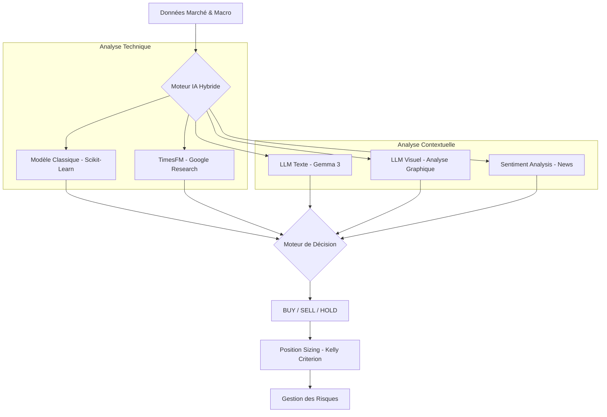

# 📉 Système de Trading IA Hybride - Résumé

Ce document résume l'architecture, les capacités et les performances du système de trading IA développé.

## 🚀 Architecture Globale

Le système repose sur une approche **tri-modale hybride**. Au lieu de faire confiance à un seul algorithme, il combine trois types d'intelligence pour prendre une décision finale.



---

## 🧠 Modèles IA Utilisés

1.  **Modèle Classique (Ensemble) :**
    *   **Algorithmes :** RandomForest, GradientBoosting, et Régression Logistique.
    *   **Sélection :** Le système teste les 3 modèles via `TimeSeriesSplit` et sélectionne automatiquement le plus performant pour la journée.
    *   **Features :** 45 indicateurs (RSI, MACD, Bollinger, Moyennes Mobiles, Yields Trésorerie US, PIB, Chômage).

2.  **LLM (Gemma 3 : 4b) :**
    *   **Texte :** Analyse les données brutes et les indicateurs pour détecter des anomalies ou des configurations de prix.
    *   **Visuel :** Analyse directement l'image du graphique technique (`enhanced_trading_chart.png`) pour identifier des supports/résistances et des patterns visuels.

3.  **TimesFM (Google Research) :**
    *   Modèle de fondation **TimesFM 2.5** (version la plus récente) spécialisé dans la prédiction de séries temporelles pour estimer la tendance à 5 jours. Intégré via un processus d'installation automatisé (`uv run setup`).

4.  **Sentiment Analysis :**
    *   Analyse en temps réel les gros titres de l'actualité financière via l'API Alpha Vantage pour ajuster le score de confiance.

---

## 📊 Tests de Validation (Backtests)

Deux tests majeurs ont été réalisés pour valider la robustesse :

### 1. Test Court (3 mois - Mai à Août 2025)
*   **Objectif :** Valider la stabilité technique du code.
*   **Résultat :** **+11.37% de rendement** en 3 mois.

### 2. Test Long (10 ans - 2015 à 2025)
*   **Conditions :** Capital initial de 1000 €, décision tous les 7 jours, frais de transaction inclus (0.1%).
*   **Rendement IA :** **+221.95%** (Capital final : **3219.45 €**).
*   **Comparaison :** L'IA a plus que triplé le capital initial. Elle a cependant sous-performé l'indice QQQ brut (+525%) car elle a privilégié la protection du capital lors des crises (notamment 2020 et 2022).

---

## 🎯 Prise de Décision

Le système ne donne pas seulement un signal, il fournit un rapport complet :

| Élément | Description |
| :--- | :--- |
| **FINAL DECISION** | `BUY`, `SELL` ou `HOLD`. |
| **CONFIDENCE** | Score de 0 à 100% basé sur le consensus des modèles. |
| **RISK LEVEL** | Évaluation du risque (VERY LOW à VERY HIGH) basée sur la volatilité. |
| **REC. POSITION** | Montant exact à investir basé sur le critère de Kelly. |

---

## 🎮 Mode Simulation (Paper Trading)

Le système inclut un mode simulation persistant pour tester les performances en temps réel sans risque.

### Caractéristiques :
- **Capital Initial :** 1000 € (fixe).
- **Persistance :** L'état du portefeuille et l'historique des trades sont sauvegardés dans `trading_history.db`.
- **Logique Strict :** Le mode simulation impose une alternance Achat -> Vente. Il est impossible d'acheter si le capital est déjà engagé, ou de vendre si aucune action n'est détenue.

```bash
# Lancer la simulation quotidienne (Défaut: SXRV.FRK)
uv run main.py --simul
```

---

## 🤖 Exécution Réelle (Trading 212)

Le système peut désormais passer des ordres réels sur un compte Trading 212 via l'API.

### Caractéristiques :
- **Sécurité et Vérification** : Consulte le cash réel et les positions ouvertes **avant** toute action.
- **Budget Dédié :** Commence avec 1000 € (paramétrable dans `t212_portfolio_state.json`).
- **Actions Fractionnées :** Le système calcule la quantité exacte (ex: 0.8172 action) pour respecter le budget au centime près.
- **Vente Totale :** En cas de signal SELL, le robot liquide 100% de la position (incluant toutes les fractions).
- **Gestion des API** : Retry automatique en cas de limite de requêtes API (Rate Limit).

```bash
# Lancer l'analyse avec exécution réelle (Mode Démo ou Live)
uv run main.py --t212
```

---

## 🛠️ Comment utiliser ?

Pour lancer une analyse complète sur un actif (Défaut: SXRV.FRK - Nasdaq 100 EUR) :
```bash
uv run main.py
```

Le script générera :
1.  Le signal dans le terminal.
2.  Un graphique technique : `enhanced_trading_chart.png`.
3.  Un tableau de bord de performance : `enhanced_performance_dashboard.png`.
