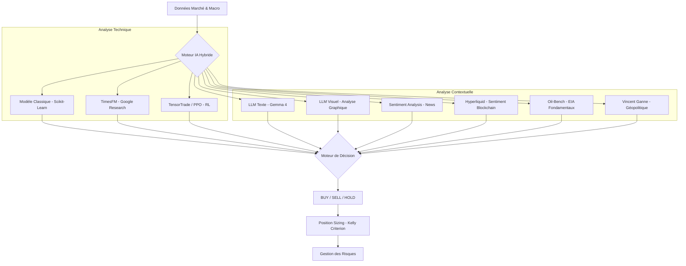

# 📉 Système de Trading IA Hybride - Résumé

Ce document résume l'architecture, les capacités et les performances du système de trading IA développé.

## 🚀 Architecture Globale

Le système repose sur une approche **multi-modale hybride**. Au lieu de faire confiance à un seul algorithme, il combine neuf types d'intelligence pour prendre une décision finale.



---

## 🧠 Modèles IA Utilisés

1.  **Modèle Classique (Ensemble) :**
    *   **Algorithmes :** RandomForest, GradientBoosting, et Régression Logistique.
    *   **Sélection :** Le système teste les 3 modèles via `TimeSeriesSplit` et sélectionne automatiquement le plus performant pour la journée.
    *   **Features :** 45 indicateurs (RSI, MACD, Bollinger, Moyennes Mobiles, Yields Trésorerie US, PIB, Chômage).

2.  **LLM (Gemma 4 : e4b) :**
    *   **Texte :** Analyse les données brutes et les indicateurs. Intègre les titres de presse en temps réel via le skill **AlphaEar** et les métriques décentralisées d'**Hyperliquid** pour une synthèse technique et fondamentale.
    *   **Visuel :** Analyse directement l'image du graphique technique (`enhanced_trading_chart.png`) pour identifier des patterns chartistes complexes.

3.  **TimesFM (Google Research) :**
    *   Modèle de fondation **TimesFM 2.5** spécialisé dans la prévision de séries temporelles.

4.  **TensorTrade / PPO (Reinforcement Learning) :**
    *   Agent **PPO** (stable-baselines3) entraîné à chaque cycle dans un environnement **Gymnasium** custom (`SimpleTradingEnv`).
    *   Apprend une politique d'achat/vente/conservation basée sur les variations de prix récentes.
    *   Poids de **10%** dans le moteur de décision. Ajoute un signal non-corrélé basé sur le comportement.

5.  **Modèle Oil-Bench (Gemma 4 : e4b) :**
    *   **Expert Fondamental :** Modèle spécialisé activé uniquement pour le pétrole (`CL=F`, `CRUDP.PA`).
    * **Données EIA :** Analyse automatisée des stocks US, des importations mensuelles et du taux d'utilisation des raffineries.
    * **Synthèse :** Produit une allocation cible (0-100%) basée sur la dynamique offre/demande physique.

6.  **Hyperliquid (Sentiment Blockchain) :**
    *   Récupération en temps réel du *Funding Rate* et de l'*Open Interest* sur les contrats perpétuels Pétrole (WTI). Utilisé comme signal contrarien pour détecter les excès spéculatifs.

7.  **Sentiment Analysis (Hybride) :**
    *   Combine les news d'Alpha Vantage avec les tendances "hot" d'**AlphaEar** (Weibo, WallstreetCN, etc.) pour une détection précoce des changements de sentiment.

8.  **Modèle Vincent Ganne (Géopolitique & Cross-Asset) :**
    *   **Validateur d'Achat Nasdaq :** Ce modèle est utilisé exclusivement pour valider des points bas sur le Nasdaq (`SXRV.DE`, `QQQ`). Il est désactivé pour le trading d'autres actifs.
    *   **Signal Unidirectionnel :** Il ne génère que des signaux `BUY` ou `HOLD`. Son but est de confirmer la détente macroéconomique (Pétrole < 94$, Dollar faible, MA200 franchie) pour autoriser une entrée sur les actions.
    *   **Filtre de Sécurité :** En cas de prix de l'énergie trop élevés (WTI > 94$), le modèle maintient un signal `HOLD` pour le Nasdaq, agissant comme un verrou de sécurité contre l'instabilité géopolitique.

---

## 🛡️ Gestion des Risques & Sizing

Le système intègre désormais un **Advanced Risk Manager** intelligent et conscient des spécificités des actifs :

1.  **Oil Special Risk Mode :** Contrairement aux actions, le Pétrole profite souvent de la volatilité et du risque géopolitique. Le Risk Manager abaisse automatiquement ses seuils de confiance pour le Pétrole en cas de risque `HIGH` ou `VERY_HIGH`, permettant de capturer des hausses impulsives là où le Nasdaq resterait en retrait.
2.  **Inertie de Sortie (Sticky HOLD) :** Lorsqu'une position est active, le système devient plus exigeant pour vendre (`SELL`). Il compare le prix actuel à l'**indice de référence lors de l'achat** (ex: prix du WTI à l'entrée). Si la position est gagnante sur l'indice, il faut un signal de vente très fort (> 0.55 de conviction) pour sortir, protégeant ainsi la tendance haussière contre le bruit passager.
3.  **Trend-Awareness :** Le système détecte la tendance de fond (Prix vs MM50). En marché haussier (Bull Market), il devient plus réactif en abaissant le seuil de confiance requis pour l'achat.
4.  **Sizing Progressif :** L'exposition varie dynamiquement entre **75% et 100%** sur signal d'achat, selon la force du consensus de l'IA.

---

## 🕒 Automatisation (Scheduler)

Un nouveau script autonome `schedule.py` permet une exécution continue sur serveur :
- **Horaires :** Lundi au Vendredi, 8h30 à 18h00.
- **Fréquence :** Analyse et trading toutes les 30 minutes.
- **Dashboard :** Suivi en temps réel de l'état du scheduler et du prochain run.

---

## 📊 Tests de Validation (Backtests)

Deux tests majeurs ont été réalisés pour valider la robustesse :

### 1. Test Court (3 mois - Mai à Août 2025)
*   **Objectif :** Valider la stabilité technique du code.
*   **Résultat :** **+11.37% de rendement** en 3 mois.

### 2. Test Long (10 ans - 2015 à 2025)
*   **Conditions :** Capital initial de 1000 €, décision tous les 7 jours, frais de transaction inclus (0.1%).
*   **Rendement IA :** **+221.95%** (Capital final : **3219.45 €**).
*   **Comparaison :** L'IA a plus que triplé le capital initial. Elle a cependant sous-performé l'indice QQQ brut (+525%) car elle a privilégié la protection du capital lors des crises (notamment 2020 et 2022).

---

## 🎯 Prise de Décision : L'Algorithme de "Justesse"

Le système ne se contente pas d'additionner les signaux. Il applique une logique de filtrage rigoureuse pour éviter les faux signaux :

1.  **Pondération Cognitive (75% vs 25%)** : Même si le modèle mathématique (`Classic`) est très agressif, il ne pèse que 25% de la note. Les modèles cognitifs (LLM, Vision, Sentiment, TimesFM) contrôlent la décision finale.
2.  **Seuil de Confiance Critique (40%)** : Toute décision de mouvement (`BUY` ou `SELL`) doit avoir une confiance globale > 40%. Si la confiance est entre 20% et 40%, le signal est dégradé en `HOLD`.
3.  **Gestion de la Panique** : En risque `VERY_HIGH`, le système exige un consensus quasi-parfait. Si les modèles divergent (ex: Classic dit SELL mais LLM dit HOLD), le système reste en `HOLD` pour protéger le capital.

| Élément | Description |
| :--- | :--- |
| **FINAL DECISION** | `BUY`, `SELL` ou `HOLD`. |
| **CONFIDENCE** | Score de 0 à 100% basé sur le consensus des modèles. |
| **RISK LEVEL** | Évaluation du risque (VERY LOW à VERY HIGH) basée sur la volatilité. |
| **REC. POSITION** | Montant exact à investir basé sur le critère de Kelly. |

---

## 🎮 Mode Simulation (Paper Trading)

Le système inclut un mode simulation persistant pour tester les performances en temps réel sans risque.

### Caractéristiques :
- **Capital Initial :** 1000 € (fixe).
- **Persistance :** L'état du portefeuille et l'historique des trades sont sauvegardés dans une base de données SQLite locale (non trackée dans git).
- **Logique Strict :** Le mode simulation impose une alternance Achat -> Vente. Il est impossible d'acheter si le capital est déjà engagé, ou de vendre si aucune action n'est détenue.

```bash
# Lancer la simulation quotidienne (Défaut: SXRV.FRK)
uv run main.py --simul
```

---

## 🤖 Exécution Réelle (Trading 212)

Le système peut désormais passer des ordres réels sur un compte Trading 212 via l'API.

### Caractéristiques :
- **Sécurité et Vérification** : Consulte le cash réel et les positions ouvertes **avant** toute action.
- **Prix Temps Réel T212** : Récupère le prix live en EUR via l'API positions Trading 212 (`get_t212_price()`). Plus rapide et plus fiable que yfinance pour les ETFs cotés.
- **Tickers Certifiés** : Utilisation des identifiants d'instruments exacts pour garantir l'exécution (`SXRVd_EQ` pour le Nasdaq EUR, `CRUDl_EQ` pour le Pétrole WTI).
- **Logique de Signal Ajusté** : Le robot utilise le signal filtré par le `AdvancedRiskManager`. Si le risque est jugé trop élevé par rapport à la confiance, l'exécution est bloquée (conversion en `HOLD`).
- **Budget Dédié :** Commence avec 1000 € (paramétrable dans `t212_portfolio_state.json`).
- **Actions Fractionnées :** Le système calcule la quantité exacte pour respecter le budget au centime près.
- **Vente Totale :** En cas de signal SELL, le robot liquide 100% de la position (incluant toutes les fractions).
- **Gestion des API** : Retry automatique en cas de limite de requêtes API (Rate Limit).

### Résilience Réseau :
- **Circuit Breaker yfinance** : Deux trackers séparés (`info` vs `download`). Après 3 échecs consécutifs, les appels sont bloqués 120s. Empêche les cascades de timeouts.
- **Hiérarchie de prix** : T212 live → yfinance → cache parquet.
- **Timeout 10s** sur tous les appels réseau (yfinance, Alpha Vantage).
- **Skip metadata** : `_yf_ticker_info()` ignoré quand le cache parquet existe (gain ~30-50s/cycle).
- **Cache Auto-Invalidation** : Si la dernière donnée du cache Parquet date de > 2 jours, un téléchargement forcé est déclenché automatiquement (`src/data.py`). Utilitaire `refresh_cache.py` pour forcer le rafraîchissement manuel de tous les tickers.
- **MA50 Fallback** : Quand MA200 est indisponible (historique insuffisant, ex: Urée/UME=F), le système utilise MA50 comme référence mobile pour les indicateurs cross-asset du modèle Vincent Ganne.

```bash
# Lancer l'analyse avec exécution réelle (Mode Démo ou Live)
uv run main.py --t212
```

---

## 🛠️ Comment utiliser ?

Pour lancer une analyse complète sur un actif (Défaut: SXRV.FRK - Nasdaq 100 EUR) :
```bash
uv run main.py
```

Le script générera :
1.  Le signal dans le terminal.
2.  Un graphique technique : `enhanced_trading_chart.png`.
3.  Un tableau de bord de performance : `enhanced_performance_dashboard.png`.
